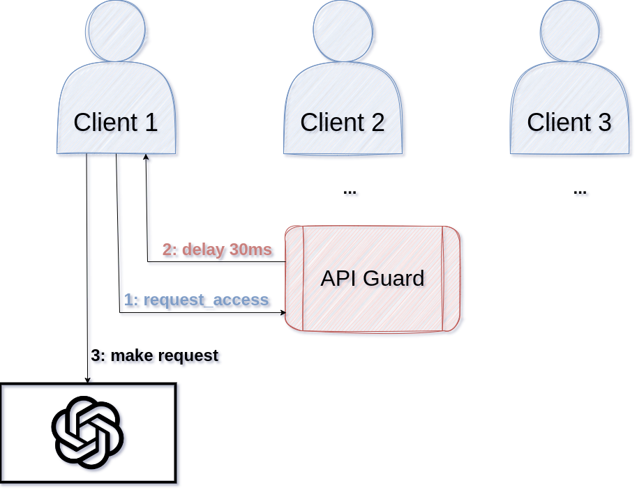
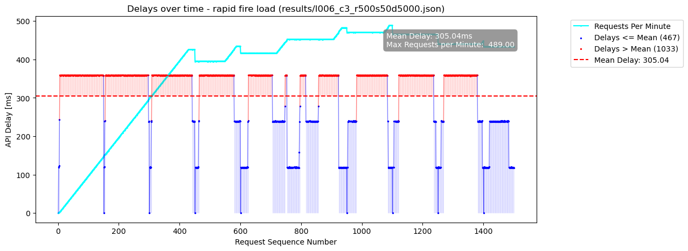

# ApiGuard

- [Overview](#overview)
- [Features](#features)
- [How it works](#how-it-works)
- [Getting Started](#getting-started)
    - [Prerequisites](#prerequisites)
    - [Installation](#installation)
    - [Configuration](#configuration)
    - [Building and Running via Zig](#building-and-running-the-service-via-zig)
    - [Running the Service in Production](#running-the-service-in-production)
    - [Running the Service via Docker
      Container](#running-the-service-via-docker-container)
    - [Furhat Kotlin Client Example](#furhat-kotlin-client-example)
- [ApiGuard API](#apiguard-api)
    - [Endpoints](#endpoints)
    - [Example Responses](#example-responses)

## Overview

ApiGuard is a rate limiting service designed to manage and protect API endpoints
from excessive use. It provides a flexible way to control the flow of requests,
ensuring APIs are used within predefined limits, thereby preventing overloading
and potential service disruptions.

**It tells clients how long they have to delay their requests or, optionally,
performs the delay for them.**

So, to integrate it with your clients, you only have to make one blocking http
request.



## Features

- **Rate Limiting**: Dynamically control the number of API requests allowed over
  a rolling 60-second window.
- **Flexible Configuration**: Adjust the rate limit on-the-fly as per your
  requirements.
- **Authentication**: Secure endpoints with token-based authentication to ensure
  only authorized modifications to rate limits.
- **Dual Delay Handling**: Choose between having the service handle request
  delays or providing delay information for client-side handling.
- A powerful [clientbot](clientbot.md) to load-test the server under various
  conditions.

## How it works

This version of ApiGuard uses a new algorithm that has been both designed for
and extensively tested against concurrent (multi client) scenarios.

ApiGuard always works on a sliding 60 seconds window and defaults to a request
delay defined by the requests per minute limit _n_.

It rasterizes the 60s window into _n_ equidistant time-slots and assigns
incoming requests to consecutive time-slots. 

For n=500, the time-slots are 120ms apart. So the first request will have a
delay of 0ms since it is the first one. The second request will be put on the
second time-slot 120ms apart from the first -> delay=120ms, if both requests
arrive at the same time.

If the second request comes in 50ms after the first, then the allocated
time-slot for it will still be the second time-slot 120ms apart from the first
one. Since the request arrived 50ms "late", the effective delay will be 120ms -
50ms = 70ms.

If three requests arrive at the same time, the first one will get a delay of
0ms, the second one of 120ms, and the third one of 240ms. A fourth request would
be assigned time-slot number 4 at 360ms. If that fourth request is the first
request of another client than the one that sent the first three, that other
client's first request will be delayed by 360ms, according to its assigned
time-slot.

Time-slots that aren't used because of slow clients will be put into a list of
"free passes" that encounter **no delay**. This allows for quickly catching up
and lowering the API request delay when the API hasn't been used for a few
time-slots.

However, free passes that are > 60s old need to be discarded as they slide out
of the 60s window, to avoid a build-up that would interfere with the time-slots
algorithm. For example, a client only making 1 request at second 0 and one at
second 59, would create about 498 free passes. If the client then goes to sleep
and tries to send 500 requests in one go 10 minutes later, the then > 10 minutes
old 498 free passes must not be used to guarantee time-slotting to work.

All the constraints mentioned above have been tested under load. See
[clientbot](clientbot.md) for more information.

The following example illustrates many of the things mentioned above: 3
concurrent clients that sleep for 5s every 50 requests, allowing the server to
use some of the free passes after those delays, etc. While for each individual
client the mean delay is > 120ms, API-requests for all clients combined are
still scheduled for roughly every 120ms.



## Getting Started

### Prerequisites

- Install zig 0.11.0 from [ziglang.org](https://ziglang.org) if you want to
  build it yourself and use the [clientbot](clientbot.md).
- To generate plots during the optional load tests, python3 is required, too,
  with the following packages installed:
    - numpy
    - matplotlib
- I recommend using [nix](https://nixos.org) as a package manager and build tool. A nix flake for a devshell, regular builds, and docker builds is provided. It provides everything, including python packages, you need to hack on this server.


### Installation

1. Clone the repository:
   ```bash
   git clone https://github.com/nim-artificial-intelligence/apiguard.zap.git
   ```
2. Navigate to the project directory:
   ```bash
   cd apiguard.zap
   ```
3. Build it (see below)
4. Configure it
5. Run it

### Configuration

1. Create a `api_guard.rc` file at `${XDG_CONFIG_HOME}/api_guard/api_guard.rc` (which usually is: `~/.config/api_guard/api_guard.rc`) with the following content:
   ```
   APIGUARD_RATE_LIMIT=500
   APIGUARD_PORT=5500
   APIGUARD_AUTH_TOKEN=YourSecretAuthToken
   APIGUARD_SLUG=/api_guard
   APIGUARD_NUM_WORKERS=8
   ```
   Note: 
   - the slug parameter is to add a prefix to the URL and is optional. If you
     use e.g. `APIGUARD_SLUG=/api_guard`, your endpoint URLs change from
     `http://host:port/...` to `http://host:port/api_guard/...`. This makes it
     easier to add the service to an existing web server or deploy multiple
     instances of api_guard for different APIs.
   - the `APIGUARD_NUM_WORKERS` setting is crucial if you plan to use multiple
     clients or threads in conjunction with server-side sleeping. As each
     server-side sleep locks a worker thread in the API Guard, make sure you
     plan ahead for enough workers to accomodate all your clients.

2. Replace `YourSecretAuthToken` with your desired token.


### Building and running the Service via zig

Execute the following command to build the server in debug mode:
```bash
zig build
```

Start it via:

```bash
# export rc file
export $(cat "$XDG_CONFIG_HOME/api_guard/api_guard.rc" | grep -v '^#' | xargs)
./zig-out/bin/apiguard # to start the server
```

Test it via:

```bash
# export rc file
export $(cat "$XDG_CONFIG_HOME/api_guard/api_guard.rc" | grep -v '^#' | xargs)
# run a simple request in another shell:
curl -H "Authorization: Bearer $API_GUARD_KEY" http://127.0.0.1:${APIGUARD_PORT}${APIGUARD_SLUG}/request_access
```

### Running the Service in Production

Make a release build:

```bash
zig build -Doptimize=ReleaseSafe
```

Put these commands in a launcher script:

```bash
#!/usr/bin/env bash

# export rc file
export $(cat "$XDG_CONFIG_HOME/api_guard/api_guard.rc" | grep -v '^#' | xargs)
./zig-out/bin/apiguard 2>&1 | tee -a logfile
```

Test it via:

```bash
# export api_guard.rc file
export $(cat "$XDG_CONFIG_HOME/api_guard/api_guard.rc" | grep -v '^#' | xargs)
# run a simple request
curl -H "Authorization: Bearer $API_GUARD_KEY" http://127.0.0.1:${APIGUARD_PORT}${APIGUARD_SLUG}/request_access
```

### Running the Service via Docker Container

1. Obtain the container from the [Releases
   Section](https://github.com/nim-artificial-intelligence/apiguard.zap/releases)
   (or build it yourself via `nix build .#apiguard_docker`)
2. Load the image into docker:
    ```bash
    docker load < downloaded_file
    # or, if you built it with nix:
    docker load < result
    ```
3. Create an api_guard.rc file, see [configuration](#configuration), and set its PORT to
   5500. That port is just used inside the container:
   ```
   PORT=5500
   ```

4. Create a run directory and move the rc file there:
    ```bash
    mkdir rundir
    mv api_guard.rc rundir/
    ```

5. Start the container (replace YOUR_PORT with the port you want):
    ```bash
    docker run -p YOUR_PORT:5500 -v $(realpath ./rundir):/tmp apiguard:latest

6. Test it via:
    ```bash
    # export api_guard.rc file
    export $(cat "$XDG_CONFIG_HOME/api_guard/api_guard.rc" | grep -v '^#' | xargs)
    # run a simple request
    curl -H "Authorization: Bearer $API_GUARD_KEY" http://127.0.0.1:${APIGUARD_PORT}${APIGUARD_SLUG}/request_access
    ```
### Furhat Kotlin Client Example

Here comes a code snippet you can use in a Furhat robot skill which is what this
service has initially been developed for:

1. Add the `khttp` dependency to your `build.gradle`:
    ```gradle
    dependencies {
        implementation 'com.furhatrobotics.furhatos:furhat-commons:2.7.1'
        implementation 'com.theokanning.openai-gpt3-java:service:0.16.0'
        compile 'khttp:khttp:1.0.0'
    }
    ```

2. Before making a request to your API, insert the following lines:
    ```kotlin
        // make a khttp request to api guard
        val API_GUARD_URL = "https://your.domain.org/api_guard"
        val API_GUARD_KEY = "YOUR AUTH TOKEN"
        val guard_response = khttp.get(
                                "$API_GUARD_URL/request_access?handle_delay=true", 
                                headers=mapOf("Authorization" to "Bearer " + API_GUARD_KEY)
                                ).text
        print("API Guard said: $guard_response")
    ```

This will let the server take care of rate limiting your API calls.

**Note:** Make sure to prepend 'Bearer ' to your API token as shown above!

## ApiGuard API

### Endpoints

- **GET /request_access**
  - URL Params: `handle_delay` (boolean)
  - Headers: `Authorization: Bearer [Auth Token]`
  - Description: Request access for API usage, optionally handling delay server-side.
  - **Response**:
    - If `handle_delay` is `false` or not provided: Returns a JSON object with `delay_ms` indicating the number of milliseconds to wait before making the API request.
    - If `handle_delay` is `true`: Performs the delay server-side and returns a JSON object with `delay_ms` set to 0.
    - The response fields `my_time_ms` and `make_request_at_ms` both are server
      side timestamps in millisecond resolution. They let you know the time the
      request was processed and the time the API request can be made (after the
      delay).
  - **Examples**: 
    - [`AUTH_TOKEN=YOUR_TOKEN ./test_delay_handled.sh`](./test_delay_handled.sh): how to use `/request_access` **with `handle_delay=true`**
    - [`AUTH_TOKEN=YOUR_TOKEN ./test_delay_unhandled.sh`](./test_delay_unhandled.sh): how to use `/request_access` **without `handle_delay=true`**


- **GET /get_rate_limit**
  - Headers: `Authorization: Bearer [Auth Token]`
  - Description: Retrieve the current rate limit.
  - **Response**:
    - Returns a JSON object with 
        - `current_rate_limit` showing the current rate limit value (number of requests allowed per 60 seconds).
        - `delay_ms` showing the current default delay in ms.
  - **Example**: 
    - [`AUTH_TOKEN=YOUR_TOKEN ./test_get_params.sh`](./test_get_params.sh): how to retrieve values via `/get_rate_limit`

- **POST /set_rate_limit**
  - JSON Params: `new_limit` (integer), `new_delay` (integer) in milliseconds
  - Headers: `Authorization: Bearer [Auth Token]`
  - Description: Update the rate limit to a new value.
  - **Response**:
    - On success: Returns a JSON object with `success` set to `true` and `new_rate_limit` indicating the updated rate limit value.
    - On failure (e.g., invalid limit value or missing parameters): Returns a JSON object with `success` set to `false` and an `error` message detailing the issue.
  - **Example**: 
    - [`AUTH_TOKEN=YOUR_TOKEN ./test_set_params.sh`](./test_set_params.sh): how to set values via `/set_rate_limit`

### Example Responses

Please see the examples:

- `./test_get_params.sh`: how to retrieve values via `/get_rate_limit`
- `./test_set_params.sh`: how to set values via `/set_rate_limit`
- `./test_delay_handled.sh`: how to use `/request_access` **with `handle_delay=true`**
- `./test_delay_unhandled.sh`: how to use `/request_access` **without `handle_delay=true`**


#### /request_access
- Success (with delay):
  ```json
  {
    "delay_ms":0,
    "current_req_per_min":499,
    "server_side_delay":169,
    "my_time_ms": 0, 
    "make_request_at_ms": 169
  }
  ```
- Success (without delay):
  ```json
  {
    "delay_ms":180,
    "current_req_per_min":499,
    "server_side_delay":0,
    "my_time_ms": 0, 
    "make_request_at_ms": 180
  }
  ```

#### /get_rate_limit
- Success:
  ```json
  { "current_rate_limit": 60, "delay_ms": 30 }
  ```

#### /set_rate_limit
- Success:
  ```json
  { "success": true, "new_rate_limit": 80, "new_delay": 45 }
  ```
- Failure:
  ```json
  { "success": false, "error": "Invalid rate limit value" }
  ```

## Contributing

Contributions are welcome! Submit a PR or send a patch file our way.

## License

This project is licensed under the [MIT License](LICENSE.md) - see the LICENSE file for details.
