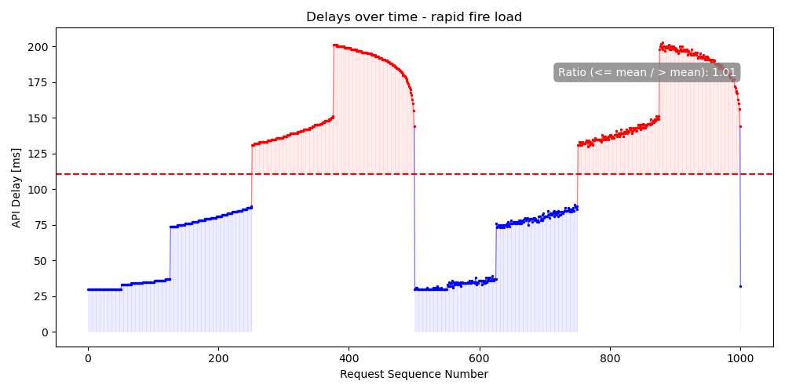

# ApiGuard

## Overview

ApiGuard is a rate limiting service designed to manage and protect API endpoints
from excessive use. It provides a flexible way to control the flow of requests,
ensuring APIs are used within predefined limits, thereby preventing overloading
and potential service disruptions.

**It tells clients how long they have to delay their requests or, optionally,
performs the delay for them.**

So, to integrate it with your clients, you only have to make one blocking http
request.


## Features

- **Rate Limiting**: Dynamically control the number of API requests allowed over
  a rolling 60-second window, supporting a constant minimum delay.
- **Flexible Configuration**: Adjust the rate limit and minimum delay on-the-fly
  as per your requirements.
- **Authentication**: Secure endpoints with token-based authentication to ensure
  only authorized modifications to rate limits.
- **Dual Delay Handling**: Choose between having the service handle request
  delays or providing delay information for client-side handling.

Here is its behavior with the default configuration:



## Getting Started

### Prerequisites

- zig 0.11.0

### Installation

1. Clone the repository:
   ```bash
   git clone https://github.com/nim-artificial-intelligence/apiguard.git
   ```
2. Navigate to the project directory:
   ```bash
   cd apiguard
   ```

### Configuration

1. Create a `api_guard.rc` file at `${XDG_CONFIG_HOME}/api_guard/api_guard.rc` (which usually is: `~/.config/api_guard/api_guard.rc`) with the following content:
   ```
   APIGUARD_RATE_LIMIT=500
   APIGUARD_PORT=5000
   APIGUARD_AUTH_TOKEN=YourSecretAuthToken
   APIGUARD_SLUG=/api_guard
   APIGUARD_DELAY=30
   ```
   Note: 
   - the slug parameter is to add a prefix to the URL and is optional. If
   you use e.g. `APIGUARD_SLUG=/api_guard`, your endpoint URLs change from
   `http://host:port/...` to `http://host:port/api_guard/...`. This makes it easier
   to add the service to an existing web server or deploy multiple instances of
   api_guard for different APIs.
   - the `APIGUARD_DELAY` parameter specifies the minimum delay issued by the
     service.

2. Replace `YourSecretAuthToken` with your desired token.


### Building and running the Service

Execute the following command to start the server:
```bash
zig build
```

Test it via:

```bash
# export rc file
export $(cat "$XDG_CONFIG_HOME/api_guard/api_guard.rc" | grep -v '^#' | xargs)
./zig-out/bin/apiguard

# run a simple request
curl http://127.0.0.1:${APIGUARD_PORT}${APIGUARD_SLUG}/request_access
```

### Running the Service in Production

Make a release build:

```bash
zig build -Doptimize=ReleaseSafe
```

Put these commands in a launcher script:

```bash
#!/usr/bin/env bash

# export rc file
export $(cat "$XDG_CONFIG_HOME/api_guard/api_guard.rc" | grep -v '^#' | xargs)
./zig-out/bin/apiguard 2>&1 | tee -a logfile

# run a simple request
curl http://127.0.0.1:${APIGUARD_PORT}${APIGUARD_SLUG}/request_access
```


3. Test it via:
    ```bash
    # export .env file
    export $(cat "$XDG_CONFIG_HOME/api_guard/.env" | grep -v '^#' | xargs)
    # run a simple request
    curl http://127.0.0.1:${APIGUARD_PORT}${APIGUARD_SLUG}/request_access
    ```

### Running the Service via Docker Container

1. Obtain the container from the download link you received (or build it
   yourself via `nix build .#apiguard_docker`)
2. Load the image into docker:
    ```bash
    docker load < downloaded_file
    # or, if you build it with nix:
    docker load < result
    ```
3. Create an .env file, see [configuration](#configuration) and set its PORT to
   5000. That port is just used inside the container:
   ```
   PORT=5000
   LOGDIR=/tmp
   ```

4. Create a run directory and move the rc file there:
    ```bash
    mkdir rundir
    mv api_guard.rc rundir/
    ```

5. Start the container (replace YOUR_PORT with the port you want):
    ```bash
    docker run -p YOUR_PORT:5500 -v $(realpath ./rundir):/tmp apiguard:latest

6. Test it via:
    ```bash
    # export .env file
    export $(cat "$XDG_CONFIG_HOME/api_guard/api_guard.rc" | grep -v '^#' | xargs)
    # run a simple request
    curl http://127.0.0.1:${APIGUARD_PORT}${APIGUARD_SLUG}/request_access
    ```
## Usage

### Endpoints

- **GET /request_access**
  - URL Params: `handle_delay` (boolean)
  - Headers: `Authorization: [Auth Token]`
  - Description: Request access for API usage, optionally handling delay server-side.
  - **Response**:
    - If `handle_delay` is `false` or not provided: Returns a JSON object with `delay_ms` indicating the number of milliseconds to wait before making the API request.
    - If `handle_delay` is `true`: Performs the delay server-side and returns a JSON object with `delay_ms` set to 0.
  - **Examples**: 
    - [`AUTH_TOKEN=YOUR_TOKEN ./test_delay_handled.sh`](./test_delay_handled.sh): how to use `/request_access` **with `handle_delay=true`**
    - [`AUTH_TOKEN=YOUR_TOKEN ./test_delay_unhandled.sh`](./test_delay_unhandled.sh): how to use `/request_access` **without `handle_delay=true`**


- **GET /get_rate_limit**
  - Headers: `Authorization: [Auth Token]`
  - Description: Retrieve the current rate limit.
  - **Response**:
    - Returns a JSON object with 
        - `current_rate_limit` showing the current rate limit value (number of requests allowed per 60 seconds).
        - `default_delay` showing the current default delay in ms.
  - **Example**: 
    - [`AUTH_TOKEN=YOUR_TOKEN ./test_get_params.sh`](./test_get_params.sh): how to retrieve values via `/get_rate_limit`

- **POST /set_rate_limit**
  - JSON Params: `new_limit` (integer), `default_delay` (integer) in milliseconds
  - Headers: `Authorization: [Auth Token]`
  - Description: Update the rate limit to a new value.
  - **Response**:
    - On success: Returns a JSON object with `success` set to `true` and `new_rate_limit` indicating the updated rate limit value.
    - On failure (e.g., invalid limit value or missing parameters): Returns a JSON object with `success` set to `false` and an `error` message detailing the issue.
  - **Example**: 
    - [`AUTH_TOKEN=YOUR_TOKEN ./test_set_params.sh`](./test_set_params.sh): how to set values via `/set_rate_limit`

### Furhat Kotlin Example

Here comes a code snippet you can use in a Furhat robot skill which is what this
service has initially been developed for:

1. Add the `khttp` dependency to your `build.gradle`:
    ```gradle
    dependencies {
        implementation 'com.furhatrobotics.furhatos:furhat-commons:2.7.1'
        implementation 'com.theokanning.openai-gpt3-java:service:0.16.0'
        compile 'khttp:khttp:1.0.0'
    }
    ```

2. Before making a request to your API, insert the following lines:
    ```kotlin
        // make a khttp request to api guard
        val API_GUARD_URL = "https://your.domain.org/api_guard"
        val API_GUARD_KEY = "YOUR AUTH TOKEN"
        val guard_response = khttp.get(
                                "$API_GUARD_URL/request_access?handle_delay=true", 
                                headers=mapOf("Authorization" to API_GUARD_KEY)
                                ).text
        print("API Guard said: $guard_response")
    ```

This will let the server take care of rate limiting your API calls.

### Example Responses

Please see the examples:

- `./test_get_params.sh`: how to retrieve values via `/get_rate_limit`
- `./test_set_params.sh`: how to set values via `/set_rate_limit`
- `./test_delay_handled.sh`: how to use `/request_access` **with `handle_delay=true`**
- `./test_delay_unhandled.sh`: how to use `/request_access` **without `handle_delay=true`**


#### /request_access
- Success (with delay):
  ```json
  { "delay_ms": 500 }
  ```
- Success (without delay):
  ```json
  { "delay_ms": 0 }
  ```

#### /get_rate_limit
- Success:
  ```json
  { "current_rate_limit": 60, "default_delay": 30 }
  ```

#### /set_rate_limit
- Success:
  ```json
  { "success": true, "new_rate_limit": 80, "new_default_delay": 45 }
  ```
- Failure:
  ```json
  { "success": false, "error": "Invalid rate limit value" }
  ```

## Contributing

Contributions are welcome! Submit a PR or send a patch file our way.

## License

This project is licensed under the [MIT License](LICENSE.md) - see the LICENSE file for details.
